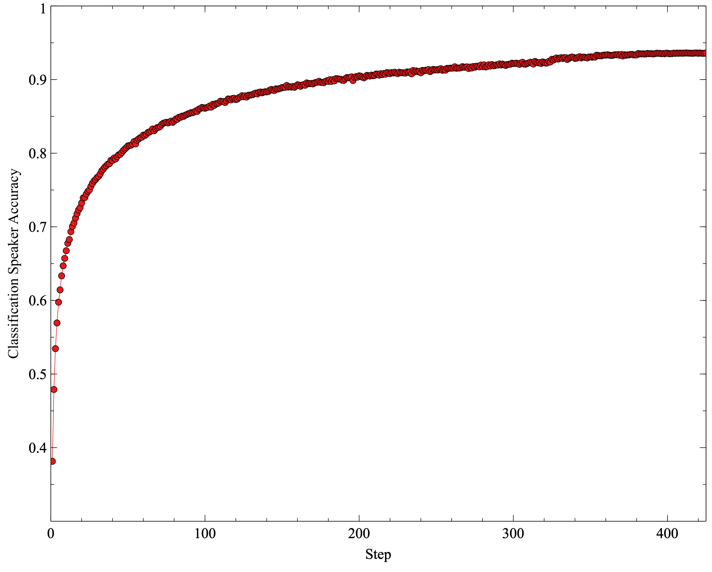
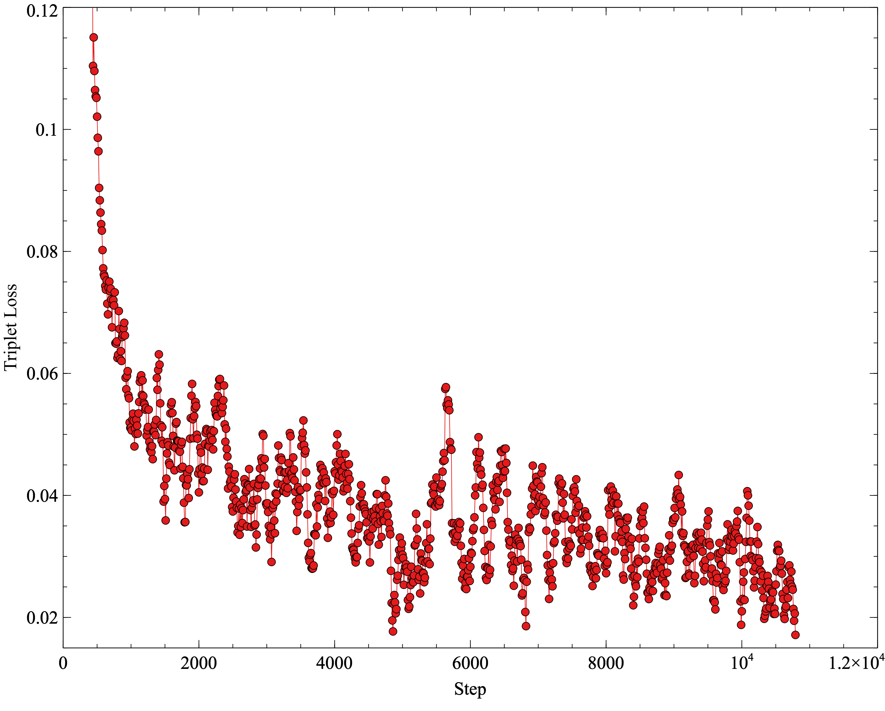

# Deep Speaker
*On VCTK Corpus with ~110 speakers*

Deep Speaker: an End-to-End Neural Speaker Embedding System https://arxiv.org/pdf/1705.02304.pdf

This is the current version that works correctly with a dataset of ~110 speakers and a smaller model (~100k parameters).

The bigger dataset and model impl can be found here: [/v3](v3). It's still a work in progress (not stable).

## Get Started

First of all, be sure to have at least 16GB of memory before running those steps. At the moment, everything is loaded in memory at the beginning for faster training speed. For now a GPU is not required because the models are pretty small. It will actually run faster on a CPU I guess.
I could run everything on my MacBookPro 2017.


Now let's clone the repository, create a virtual environment, install the dependencies, build the audio and inputs caches, run the softmax pre-training and start the training of the deep speaker embeddings.

### Installation

```bash
git clone git@github.com:philipperemy/deep-speaker.git && cd deep-speaker

DS_DIR=~/deep-speaker-data
AUDIO_DIR=$DS_DIR/VCTK-Corpus/
CACHE_DIR=$DS_DIR/cache/

mkdir -p $DS_DIR

./download_vctk.sh # if it's too long, consider using a download accelerator like: axel.
mv ~/VCTK-Corpus $DS_DIR

# will probably work on every python3 impl (e.g. 3.5).
virtualenv -p python3.6 $DS_DIR/venv-speaker
source $DS_DIR/venv-speaker/bin/activate

pip install -r requirements.txt
pip install tensorflow # or tensorflow-gpu if you have a GPU at hand.
```

### Generate audio caches

**Those steps are only required if you want to re-train the model. Instead, if you just want to perform an inference with a pre-trained network, you can skip and go to the generation section.**

The first step generates the cache for the audio files. Caching usually involves sampling the WAV files at 8KHz and trimming the silences. The task took roughly 10min on my server (i7 8770K).

```bash
python cli.py --regenerate_full_cache --multi_threading --cache_output_dir $CACHE_DIR --audio_dir $AUDIO_DIR
```

The second step generates the inputs used in the softmax pre-training and the embeddings training. Everything is cached to make the training smoother and faster. In a nutshell, MFCC windows randomly sampled from the audio cached files and put in a unified pickle file. The task took roughly 18min on my server (i7 8770K).

```bash
python cli.py --generate_training_inputs --multi_threading --cache_output_dir $CACHE_DIR --audio_dir $AUDIO_DIR
```

### Run softmax pre-training and embeddings training with triplet loss

**Likewise, those steps are only required if you want to re-train the model.**

We perform softmax pre-training to avoid getting stuck in a local minimum. After the softmax pre-training, the speaker classification accuracy should be around 95%.

```bash
python train_cli.py --loss_on_softmax --data_filename $CACHE_DIR/full_inputs.pkl
```

<p align="center">
  <br/>
</p>

It took roughly 1 hour to train with a GTX1070 and 32GB of memory. Next phase is to train the network with the triplet loss.

```bash
python train_cli.py --loss_on_embeddings --normalize_embeddings --data_filename $CACHE_DIR/full_inputs.pkl
```

Training the embeddings with the triplet loss (specific to deep speaker) takes time and the loss should go around 0.02 after ~5k steps (on un-normalized embeddings). After only 2k steps, I had 0.04-0.05. I noticed that the softmax pre-training really helped the convergence be faster. The case where (anchor speaker == positive speaker == negative speaker) yields a loss of 0.20. This optimizer gets stuck and cannot do much. This is expected. We can clearly see that the model is learning something. I recall that we train with (anchor speaker == positive speaker != negative speaker).


<p align="center">
  <br/>
</p>

### Generate embeddings with a pre-trained network

#### From speakers in the VCTK dataset

We didn't train on the following speakers: p363, p364, p374, p376. However, we generated the cache for them (because they were part of the initial dataset). So we can just run the inference with a single command.

This command will:
- check that the embeddings are L2-normalized (L2-norm should be 1).
- check that the SAP is much lower than the SAN.

```bash
python cli.py --unseen_speakers p363,p364 --audio_dir $AUDIO_DIR --cache_output_dir $CACHE_DIR
python cli.py --unseen_speakers p363,p363 --audio_dir $AUDIO_DIR --cache_output_dir $CACHE_DIR
```
The first cosine value is the SAN and the second the SAP. I could get cosine values of ~0.56 and ~0.0008. The audio slices are randomly chosen so it's very likely you get different results than me. However you should always see SAN >> SAP.

#### From any WAV files

There's an extra step here. We need to generate the cache for those new audio files. Let's divide the WAV files per speaker, with one folder per speaker. The name of the folder must match with the name of the speaker.

```
samples
└── PhilippeRemy
    ├── PhilippeRemy_001.wav
    ├── PhilippeRemy_002.wav
    ├── PhilippeRemy_003.wav
    ├── PhilippeRemy_004.wav
```

Once it's done, we can run a cache update:

```bash
NEW_AUDIO_DIR=./samples/PhilippeRemy/
python cli.py --update_cache --multi_threading --audio_dir $NEW_AUDIO_DIR --cache_output_dir $CACHE_DIR
```

We can check the SAN and SAP of our new speaker `PhilippeRemy` by running:

```bash
python cli.py --unseen_speakers p225,PhilippeRemy --audio_dir $NEW_AUDIO_DIR --cache_output_dir $CACHE_DIR
python cli.py --unseen_speakers PhilippeRemy,PhilippeRemy --audio_dir $NEW_AUDIO_DIR --cache_output_dir $CACHE_DIR
```

I had a cosine dist value of ~0.41 for the first command (different speakers) and ~0.01 for the second command (same speaker). Again, it's expected. The choice of p225 is completely arbitrary, as long as it's a different speaker.

This command will compute and display the embedding vector:

```bash
python cli.py --get_embeddings PhilippeRemy --cache_output_dir $CACHE_DIR --audio_dir $AUDIO_DIR
```

For now, it's insanely slow. It took ~2min on my MacBook and ~1min on my server.

### Miscellaneous

Once the embeddings are correctly trained, we can freeze the weights and only re-train the softmax layer with the new embeddings.

```bash
python train_triplet_softmax_model.py --loss_on_softmax --freeze_embedding_weights --normalize_embeddings
```

After a while, we get an accuracy around 71%. Not bad! We expect it to be less than 95% of course, because the embeddings are not trained to maximize the classification accuracy but to reduce the triplet loss (maximize cosine distance between different speakers).

### Important comments

- At the moment, I'm using a sigmoid for the embeddings. Meaning that the embeddings are defined on [0, 1]^n. Using tanh will project them on [-1, 1]^n.
