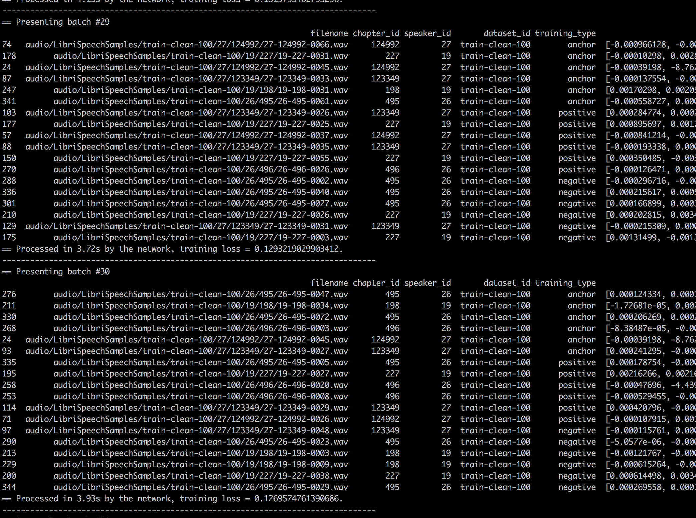

# Deep Speaker from Baidu Research
[](https://github.com/philipperemy/keras-attention-mechanism/blob/master/LICENSE) 
[](https://keras.io/) 
[](https://www.tensorflow.org/) 

Deep Speaker: an End-to-End Neural Speaker Embedding System https://arxiv.org/pdf/1705.02304.pdf

## Call for contributors

This code is not functional yet! I'm making a call for contributors to help make a great implementation! The basics stuffs are already there. Thanks!

Work accomplished so far:
- [x] Triplet loss
- [x] Triplet loss test
- [x] Model implementation
- [x] Data pipeline implementation. We're going to use the [LibriSpeech dataset](http://www.openslr.org/12/) with 2300+ different speakers.
- [ ] Train the models 

## Get started!

Simply run those commands:

```
git clone https://github.com/philipperemy/deep-speaker.git
cd deep-speaker
pip3 install -r requirements.txt
cd audio/
./convert_flac_2_wav.sh # make sure ffmpeg is installed!
cd ..
python3 models_train.py
```

Preconditions:
* Installed tensorflow: https://www.tensorflow.org/install/install_linux
* `sudo apt-get install python3-tk ffmpeg`
* ~ 6 GB memory

## Setup Windows

* install [ffmpeg](http://ffmpeg.zeranoe.com/builds/) (and add to PATH)
* use git bash for: `cd audio; ./convert_flac_2_wav.sh`
* other steps analogous to above

## Contributing

Please message me if you want to contribute. I'll be happy to hear your ideas. There are a lot of undisclosed things in the paper, such as:

- Input size to the network? Which inputs exactly?
- How many filter banks do we use?
- Sample Rate?

## LibriSpeech Dataset

Available here: http://www.openslr.org/12/

List of possible other datasets: http://kaldi-asr.org/doc/examples.html

Extract of this dataset:

```
                                                                            filenames chapter_id speaker_id dataset_id
0  /Volumes/Transcend/data-set/LibriSpeech/dev-clean/1272/128104/1272-128104-0000.wav     128104       1272  dev-clean
1  /Volumes/Transcend/data-set/LibriSpeech/dev-clean/1272/128104/1272-128104-0001.wav     128104       1272  dev-clean
2  /Volumes/Transcend/data-set/LibriSpeech/dev-clean/1272/128104/1272-128104-0002.wav     128104       1272  dev-clean
3  /Volumes/Transcend/data-set/LibriSpeech/dev-clean/1272/128104/1272-128104-0003.wav     128104       1272  dev-clean
4  /Volumes/Transcend/data-set/LibriSpeech/dev-clean/1272/128104/1272-128104-0004.wav     128104       1272  dev-clean
5  /Volumes/Transcend/data-set/LibriSpeech/dev-clean/1272/128104/1272-128104-0005.wav     128104       1272  dev-clean
6  /Volumes/Transcend/data-set/LibriSpeech/dev-clean/1272/128104/1272-128104-0006.wav     128104       1272  dev-clean
7  /Volumes/Transcend/data-set/LibriSpeech/dev-clean/1272/128104/1272-128104-0007.wav     128104       1272  dev-clean
8  /Volumes/Transcend/data-set/LibriSpeech/dev-clean/1272/128104/1272-128104-0008.wav     128104       1272  dev-clean
9  /Volumes/Transcend/data-set/LibriSpeech/dev-clean/1272/128104/1272-128104-0009.wav     128104       1272  dev-clean
```

## Training example on GPU

<p align="center">
  
  <br><i>Training on the GPU.</i>
</p>

## Vizualization of anchors

<p align="center">
  
  <br><i>Visualization of a possible triplet (Anchor, Positive, Negative) in the cosine similarity space</i>
</p>
